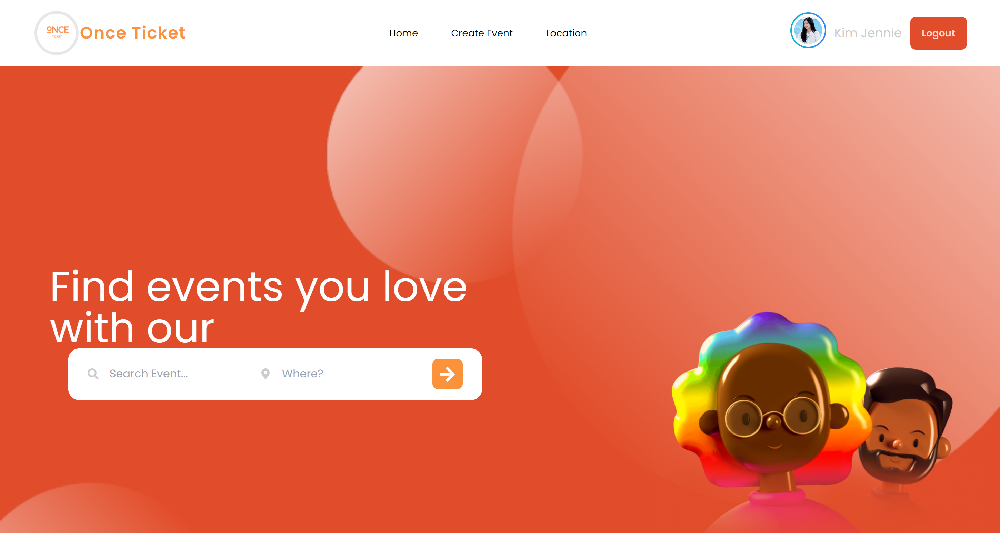
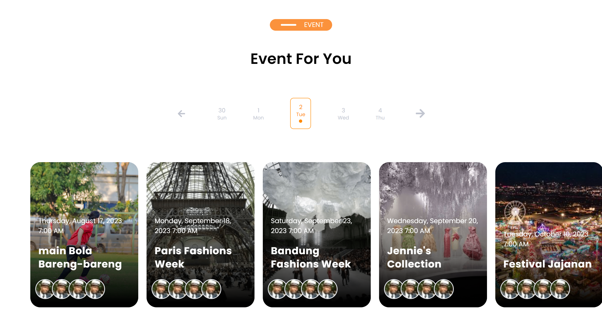
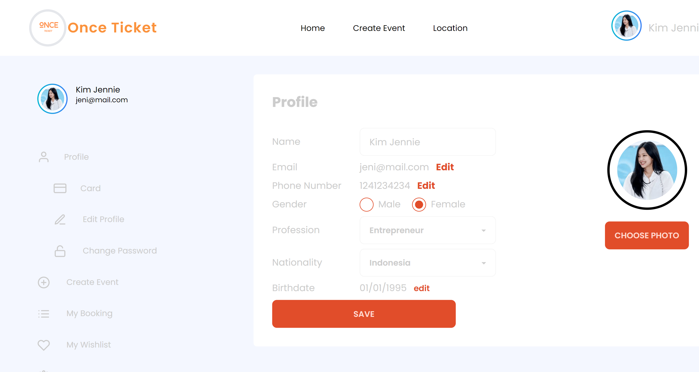
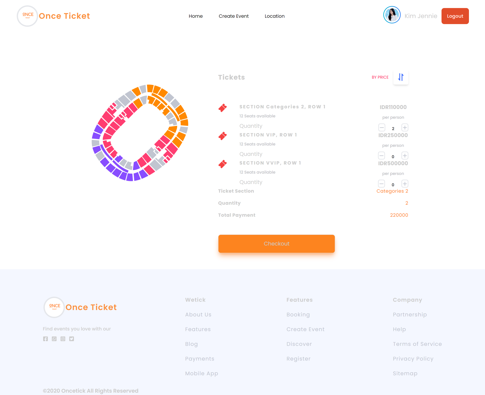

# OnceTicket

OnceTicket App is a web application that helps you to order the events you want, not only that you can manage your own events such as create, edit, update & delete


## Screenshoots
- Home Page
- Events List
- Profile Page
- Checkout Page
## Build With
- [Frontend]()
1. [ReactJS](https://reactnative.dev/)

- [Backend]()
1. [Node js](https://nodejs.org/en/)
2. [Express js](https://expressjs.com/en/starter/installing.html)
## Tech Stack
- [Redux](https://redux.js.org/)
- [Axios](https://axios-http.com/docs/intro)
- [Argon](https://www.npmjs.com/package/argon2)
- [jwt token](https://www.npmjs.com/package/jsonwebtoken)
- [Multer](https://www.npmjs.com/package/multer)
- [Moment](https://momentjs.com/)
- [Formik](https://formik.org/)
## Run Locally
Clone the project

```bash
  https://github.com/ardazh/fw15-frontend
```

Go to the project directory

```bash
  cd fw15-frontend
```

Install dependencies

```bash
  npm install
```

Start the server

```bash
  npm run dev
```
```

Go to the project directory

```bash
  cd fw15-frontend
```

Install dependencies

```bash
  npm install
```

Start the server

```bash
  npm run dev
```
